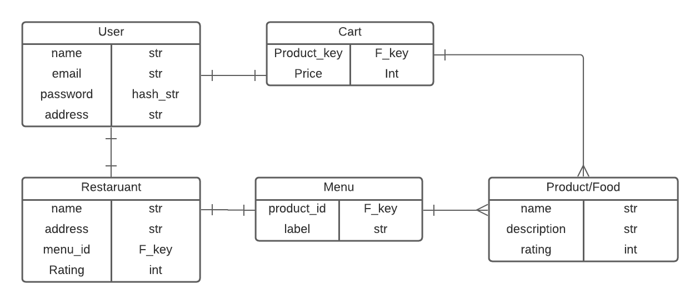
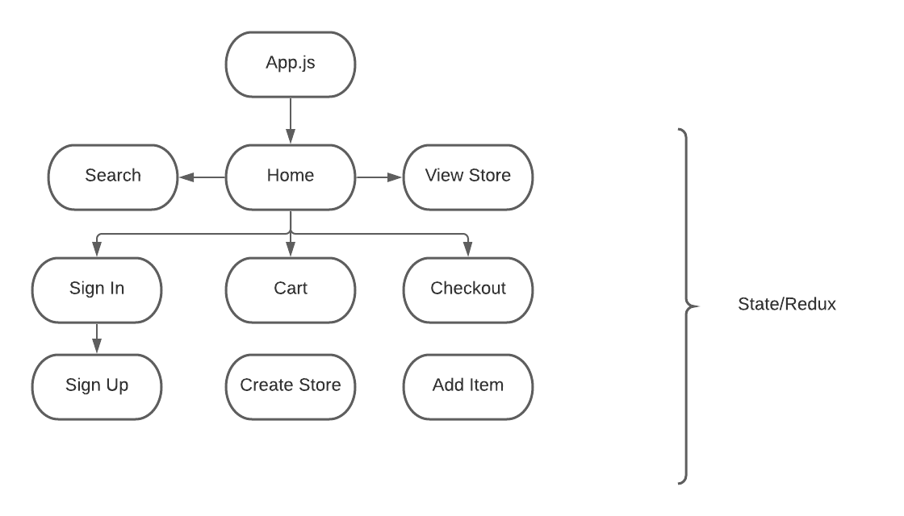

# skyshop

### By: Cesar De Casas

[Github](https://github.com/cesardecasas) | [LinkedIn](https://www.linkedin.com/in/cesardecasas/)

***

### Overview

New way to get your hands in what you love the most! Find your favorite meals at the reach of your hand!

***

### ERD and CHD
#### ERD

#### CHD


***
### How to get started

Install all the independencies needed with either ```npm install ``` or ``` yarn install ``` depending on your package manager.

You can find the deployed link [here]()

***

### User Stories

* As a user I should be able to create a profile as buyer and add restauran profile
* As a user I should be able to search for restaurants
* As a user I should be able to view details about a product
* As a user I should be able to add that product to my cart
* As a user I should be able to put an article on sale
